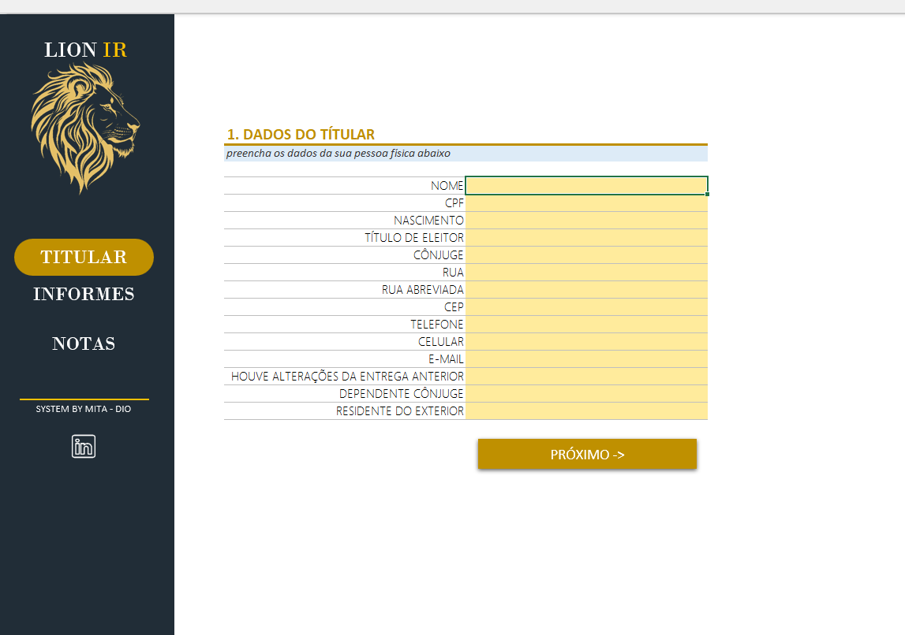
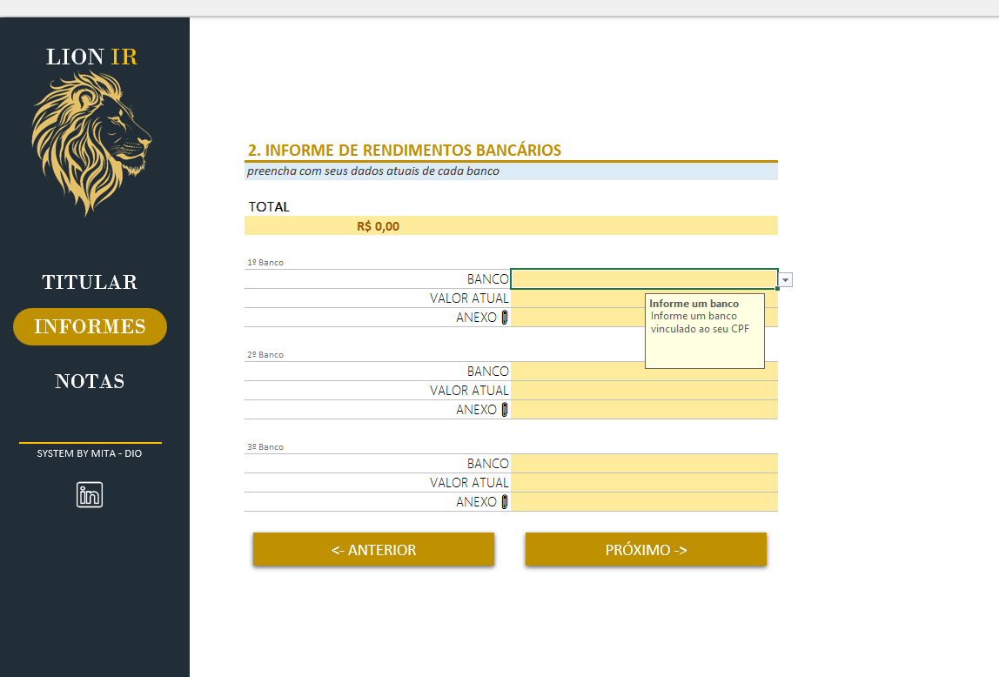
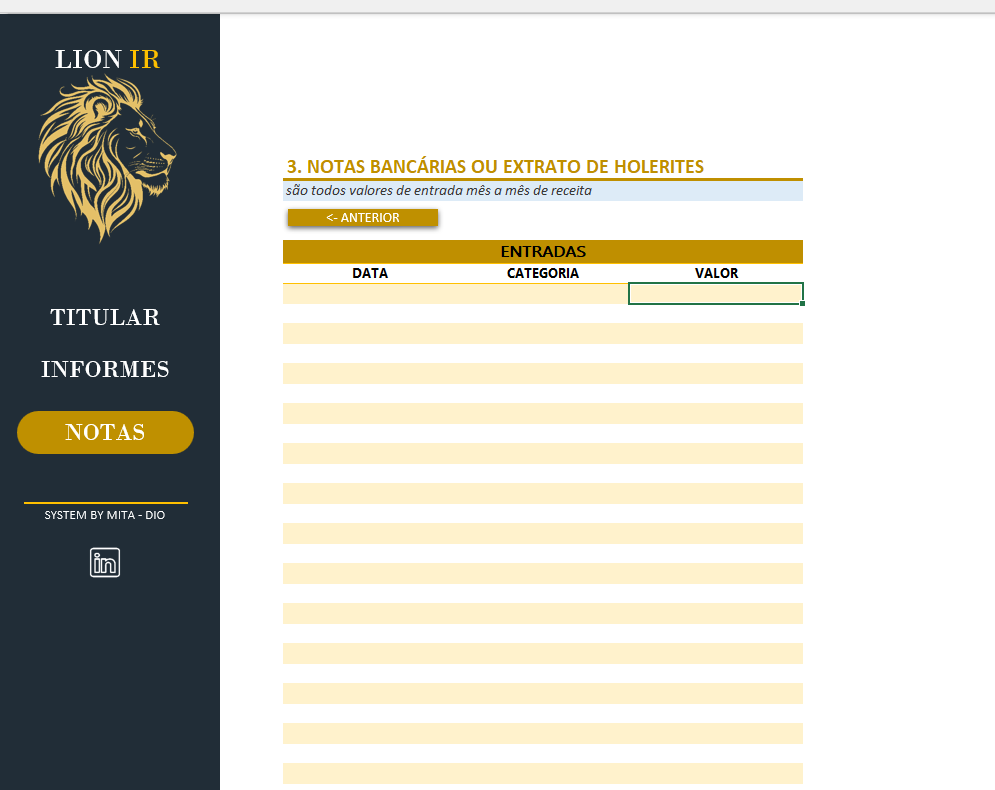

# 🧾 Projeto: Organizador de Dados para Declaração de Imposto de Renda - Excel

Este projeto foi desenvolvido como parte do desafio prático da plataforma **DIO**, com o objetivo de criar uma ferramenta no **Microsoft Excel** que auxilie na organização e controle de dados para a declaração de **Imposto de Renda**.

## 🎯 Objetivo

Construir um agregador de dados no Excel que permita ao usuário:

- Controlar entradas de forma eficiente e validada;
- Navegar entre menus com facilidade;
- Utilizar funcionalidades extras como **links rápidos**, **validações automáticas**, e interface amigável.

---

## 🛠️ Funcionalidades Implementadas

- 📊 Planilha com estrutura separada por categorias: **Titular**, **Informes**, **Notas**;
- ✅ Validações de dados para evitar erros de preenchimento;
- 🔗 Links de navegação entre abas e botões personalizados;
- 📎 Menu interativo com atalhos para facilitar o uso;
- 📌 Uso de fórmulas como `HIPERLINK`.

---

## 🧩 Estrutura do Arquivo

- `Simulador de IR.xlsx`: Arquivo principal da ferramenta;
- `/images`: Pasta com capturas de tela da planilha em funcionamento (opcional).

---

## 🚀 Como Usar

1. Baixe o arquivo `Simulador de IR.xlsx`;
2. Abra no Microsoft Excel (versão 2016 ou superior recomendada);
3. Navegue entre as abas usando o menu principal;
4. Preencha os dados conforme solicitado em cada categoria;
5. Acompanhe os totais e status no dashboard ou na aba de resumo.

---

## 📸 Capturas de Tela

Abaixo estão exemplos visuais da planilha de Simulador de IR:

### 📄 Aba Titular

### 📊 Aba Informes

### 📊 Aba Notas

---

## 📚 Aprendizados

Durante o desenvolvimento deste projeto, pude aplicar na prática conceitos como:

- Organização lógica de dados no Excel;
- Criação de menus de navegação;
- Automação com fórmulas;
- Importância de uma documentação clara para o GitHub.

---

## 🧑‍💻 Autor

**Alexandre Mita**  
Desenvolvido como parte do curso e com o compartilhamento dos conhecimentos do Felipão na plataforma **Digital Innovation One (DIO)**.

---

## 📄 Licença

Este projeto está sob a licença MIT. Sinta-se à vontade para usar e modificar conforme necessário.
